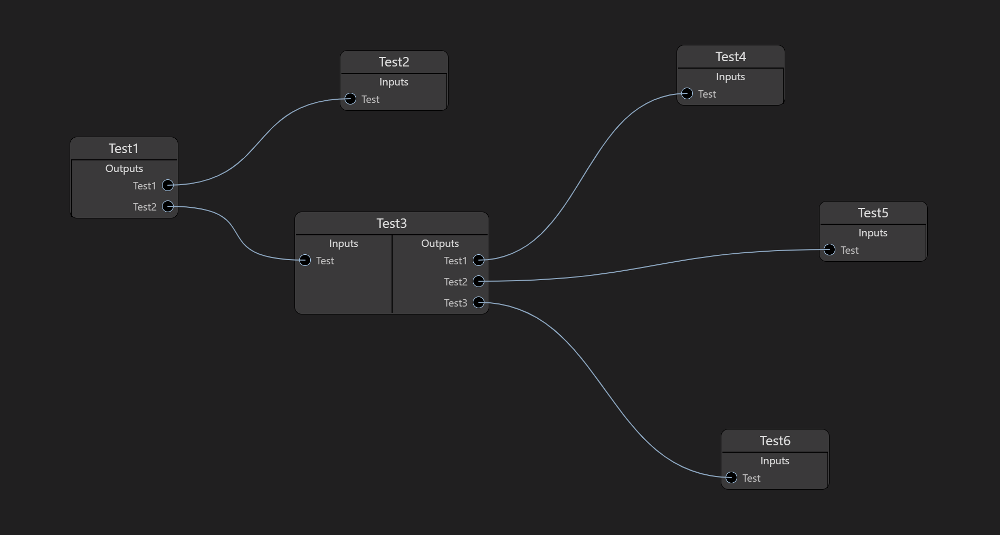

# Graph Editor
This is an interactive editor for viewing and editing complex graph structures.

Written using the [Svelte Compiler](https://svelte.dev/), it uses vanilla javascript to enable drag and drop functionality for graph nodes and displays relationships between the inputs and outputs of each node.



A demo of it is viewable [here](https://jmussett.github.io/GraphEditor/)

## Graph data format

The JSON format used by the editor uses a simple flat structure of a graph, with a seperate array to define relations:

```javascript
{
 nodes: [
  {
   name: "Test1",
   inputs: [],
   outputs: [
    {
     label: "Test"
    }
   ]
  },
  {
   name: "Test2",
   inputs: [
    {
     label: "Test"
    }
   ],
   outputs: []
  }
 ],
 relations: [
  {
   sourceNodeIndex: 0,
   sourceSocketIndex: 0,
   targetNodeIndex: 1,
   targetSocketIndex: 0
  }
 ]
}
```

As you can see, each node in the graph has a series of input and out sockets allowing them to form relations between parent and child nodes.

The relation entries represent connections between source node sockets and target node sockets.

## The Draggable and Selectable Components

The Draggable and Selectable components were created to provide drag and select functionality by utilizing mouse and touch events. The event callbacks are propagated upwards to be utilized by the parent graph component.
The events need to be controlled by the graph container component to allow select and drag state to be controlled independantly.

## Path relations with Bezier Curves.

Each relation between each node tracks the position of input and output sockets of each node and draws an SVG path between them. It utilizes 2 hidden control points to control the resulting curve between each node.

## Upcoming Features.

The ability to modify the graph is still a work in progress. The intension is to restructure the graph by selecting sockets or path relations and dragging the relation to a new node.

